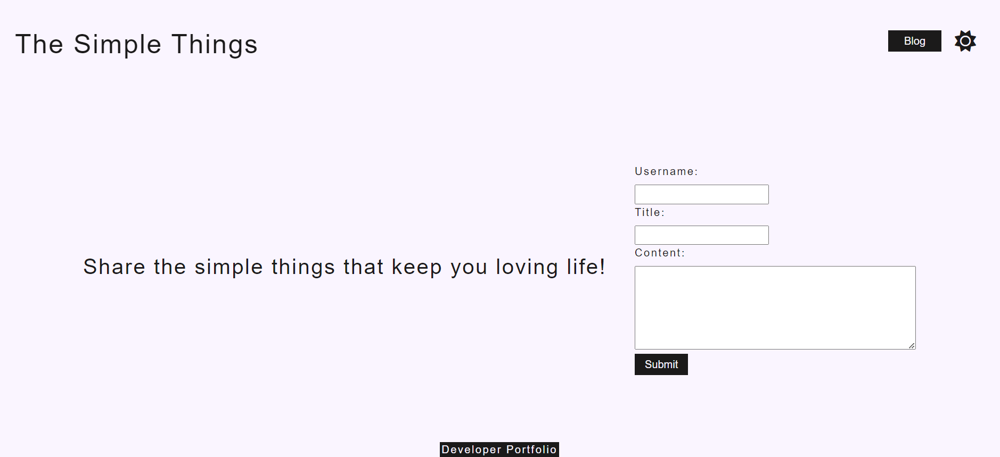
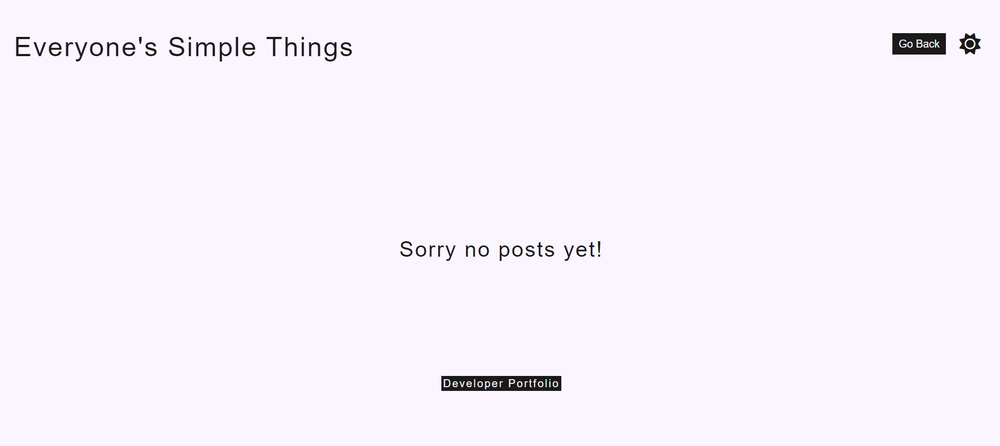

# LaPierre-Blog
A blog for myself and other users to post and show their thoughts and opinions.

## Description

The blog that was created was made to give myself and others a space to share what it is that they enjoy about living life. In the posted blogs page, everyone that visits the site will be able to see what others simple pleasures are.

## Purpose

The purpose of the blog was to create a space for people to come together and share things about themselves

## Installation

There are no installation steps required for this project. Simply click the link provided: XXXXXXX or you can clone the repository titled LaPierre-Blog and launch the index.html file in your default browser.

## Usage

Once you've either clicked the link or cloned the repository and launched the index.html file, use a mouse and keyboard or a phone/tablet with a touchscreen to click on the form inputs and put in your username, title, and content. Once you've finished filling in all fields, click submit. The page will redirect you to a new page of blogs. There, you will be able to see your post as well as anyone else that has submitted content.

Attached are screenshots of what the website should look like when visiting.

